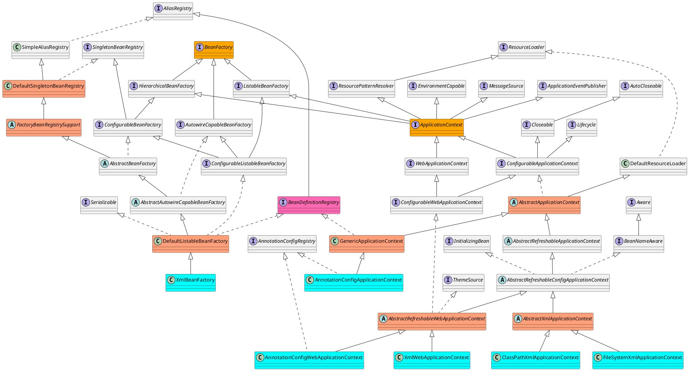
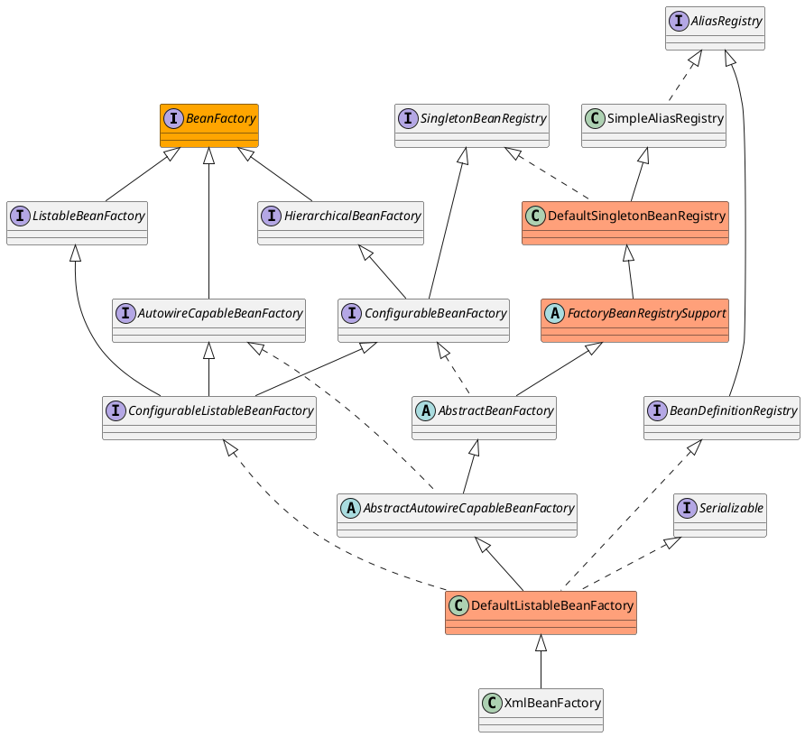
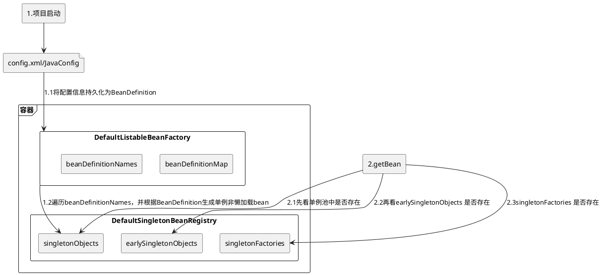
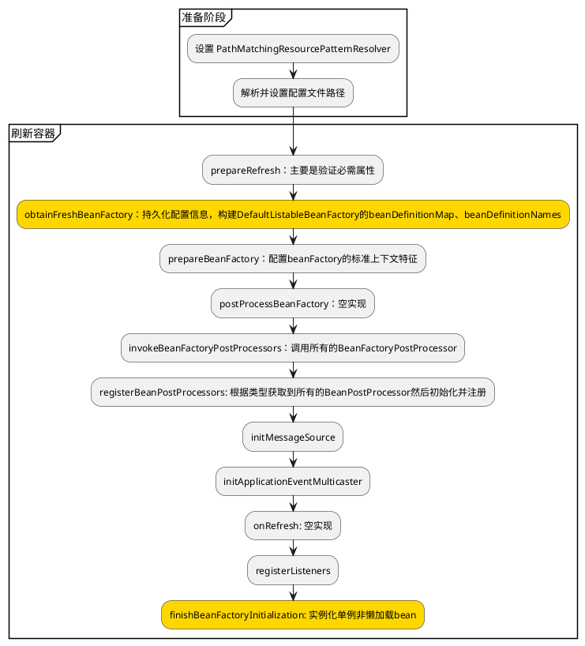

# Spring容器的基本实现

[toc]

## 前言

### 推荐阅读

> - [Spring BeanFactory 类图详解](https://blog.csdn.net/qq_34090008/article/details/78772189)
> - [spring 主要涉及类类图](https://blog.csdn.net/strivezxq/article/details/44560771)
> - [Spring容器](https://www.jianshu.com/p/ab1bf09f6501)

## 一、基本概念

### 1.容器相关类图


#### 1.1 容器概览




#### 1.2 DefaultListableBeanFactory




#### 1.3 


## 二、容器的创建过程

以 `ClassPathXmlApplicationContext` 的创建过程为例：

```java

public class ApplicationContextTest {

	@Test
	public void testClassPathXmlApplicationContext() {
		ClassPathXmlApplicationContext applicationContext = new ClassPathXmlApplicationContext("beanFactoryTest.xml");
		MyTestBean bean = (MyTestBean) applicationContext.getBean("myTestBean");
		Assert.assertEquals("testStr", bean.getTestStr());
	}

}

```


### 1.流程图





----

---




### 2.时序图


### 3.具体流程分析

ClassPathXmlApplicationContext的构造器如下：

```java
public ClassPathXmlApplicationContext(String[] configLocations, boolean refresh, ApplicationContext 	         parent) {
    //设置 PathMatchingResourcePatternResolver
    super(parent);
    setConfigLocations(configLocations);
    //默认true
    if (refresh) {
        refresh();
    }
}
```


#### 3.1 设置 PathMatchingResourcePatternResolver

（1）首先看父类构造器，沿着继承体系一直向上调用，直到AbstractApplicationContext:

```java
public AbstractApplicationContext(ApplicationContext parent) {
    this();
    setParent(parent);
}
public AbstractApplicationContext() {
    this.resourcePatternResolver = getResourcePatternResolver();
}
```

getResourcePatternResolver:

```java
protected ResourcePatternResolver getResourcePatternResolver() {
    return new PathMatchingResourcePatternResolver(this);
}
```

PathMatchingResourcePatternResolver支持Ant风格的路径解析。


由于parent 为null，因此此处是将parent置空 

```java
	@Override
	public void setParent(@Nullable ApplicationContext parent) {
        //设置 parent ApplicationContext
		this.parent = parent;
		if (parent != null) {
            // 合并父子容器的 Environment
			Environment parentEnvironment = parent.getEnvironment();
			if (parentEnvironment instanceof ConfigurableEnvironment) {
				getEnvironment().merge((ConfigurableEnvironment) parentEnvironment);
			}
		}
	}
```


#### 3.2 设置配置文件路径

即AbstractRefreshableConfigApplicationContext.setConfigLocations:

```java
	public void setConfigLocations(@Nullable String... locations) {
		if (locations != null) {
			Assert.noNullElements(locations, "Config locations must not be null");
			this.configLocations = new String[locations.length];
			for (int i = 0; i < locations.length; i++) {
				this.configLocations[i] = resolvePath(locations[i]).trim();
			}
		}
		else {
			this.configLocations = null;
		}
	}
```

resolvePath:

```java
protected String resolvePath(String path) {
    return getEnvironment().resolveRequiredPlaceholders(path);
}
```

此方法的目的在于将占位符(placeholder)解析成实际的地址。比如可以这么写: `new ClassPathXmlApplicationContext("classpath:config.xml");`那么classpath:就是需要被解析的。

getEnvironment方法来自于ConfigurableApplicationContext接口，源码很简单，如果为空就调用createEnvironment创建一个。AbstractApplicationContext.createEnvironment:

```java
protected ConfigurableEnvironment createEnvironment() {
    return new StandardEnvironment();
}
```


AbstractEnvironment.resolveRequiredPlaceholders

```
	@Override
	public String resolveRequiredPlaceholders(String text) throws IllegalArgumentException {
		return this.propertyResolver.resolveRequiredPlaceholders(text);
	}
```


AbstractPropertyResolver.resolveRequiredPlaceholders

```java
	@Override
	public String resolveRequiredPlaceholders(String text) throws IllegalArgumentException {
		if (this.strictHelper == null) {
			this.strictHelper = createPlaceholderHelper(false);
		}
		return doResolvePlaceholders(text, this.strictHelper);
	}
	
	private PropertyPlaceholderHelper createPlaceholderHelper(boolean ignoreUnresolvablePlaceholders) {
		// this.placeholderPrefix :  ${
        // this.placeholderSuffix :  }
        // this.valueSeparator    :  :
        return new PropertyPlaceholderHelper(this.placeholderPrefix, this.placeholderSuffix,
				this.valueSeparator, ignoreUnresolvablePlaceholders);
	}
	
	private String doResolvePlaceholders(String text, PropertyPlaceholderHelper helper) {
		return helper.replacePlaceholders(text, this::getPropertyAsRawString);
	}
	
```

这里是解析配置文件路径中包含的占位符

```java
System.setProperty("spring", "classpath");
ClassPathXmlApplicationContext context = new ClassPathXmlApplicationContext("${spring}:config.xml");
SimpleBean bean = context.getBean(SimpleBean.class);
```


这样就能成功设置配置文件路径了


## 三、refresh

Spring bean解析就在此方法

```java
@Override
	public void refresh() throws BeansException, IllegalStateException {
		synchronized (this.startupShutdownMonitor) {
			// Prepare this context for refreshing.
			prepareRefresh();

			// Tell the subclass to refresh the internal bean factory.
			ConfigurableListableBeanFactory beanFactory = obtainFreshBeanFactory();

			// Prepare the bean factory for use in this context.
			prepareBeanFactory(beanFactory);

			try {
				// Allows post-processing of the bean factory in context subclasses.
				postProcessBeanFactory(beanFactory);

				// Invoke factory processors registered as beans in the context.
				invokeBeanFactoryPostProcessors(beanFactory);

				// Register bean processors that intercept bean creation.
				registerBeanPostProcessors(beanFactory);

				// Initialize message source for this context.
				initMessageSource();

				// Initialize event multicaster for this context.
				initApplicationEventMulticaster();

				// Initialize other special beans in specific context subclasses.
				onRefresh();

				// Check for listener beans and register them.
				registerListeners();

				// Instantiate all remaining (non-lazy-init) singletons.
				finishBeanFactoryInitialization(beanFactory);

				// Last step: publish corresponding event.
				finishRefresh();
			}

			catch (BeansException ex) {
				if (logger.isWarnEnabled()) {
					logger.warn("Exception encountered during context initialization - " +
							"cancelling refresh attempt: " + ex);
				}

				// Destroy already created singletons to avoid dangling resources.
				destroyBeans();

				// Reset 'active' flag.
				cancelRefresh(ex);

				// Propagate exception to caller.
				throw ex;
			}

			finally {
				// Reset common introspection caches in Spring's core, since we
				// might not ever need metadata for singleton beans anymore...
				resetCommonCaches();
			}
		}
	}

```


### 1.prepareRefresh

```java
	protected void prepareRefresh() {
		// Switch to active.
		this.startupDate = System.currentTimeMillis();
		this.closed.set(false);
		this.active.set(true);

		if (logger.isDebugEnabled()) {
			if (logger.isTraceEnabled()) {
				logger.trace("Refreshing " + this);
			}
			else {
				logger.debug("Refreshing " + getDisplayName());
			}
		}

		// Initialize any placeholder property sources in the context environment.
        // 空实现
		initPropertySources();

		// Validate that all properties marked as required are resolvable:
		// see ConfigurablePropertyResolver#setRequiredProperties
		getEnvironment().validateRequiredProperties();

		// Store pre-refresh ApplicationListeners...
		if (this.earlyApplicationListeners == null) {
			this.earlyApplicationListeners = new LinkedHashSet<>(this.applicationListeners);
		}
		else {
			// Reset local application listeners to pre-refresh state.
			this.applicationListeners.clear();
			this.applicationListeners.addAll(this.earlyApplicationListeners);
		}

		// Allow for the collection of early ApplicationEvents,
		// to be published once the multicaster is available...
		this.earlyApplicationEvents = new LinkedHashSet<>();
	}
```

#### 1.1 属性校验

AbstractEnvironment.validateRequiredProperties:

```java
@Override
public void validateRequiredProperties() throws MissingRequiredPropertiesException {
    this.propertyResolver.validateRequiredProperties();
}
```

AbstractPropertyResolver.validateRequiredProperties:

```java
@Override
public void validateRequiredProperties() {
    MissingRequiredPropertiesException ex = new MissingRequiredPropertiesException();
    for (String key : this.requiredProperties) {
        if (this.getProperty(key) == null) {
            ex.addMissingRequiredProperty(key);
        }
    }
    if (!ex.getMissingRequiredProperties().isEmpty()) {
        throw ex;
    }
}
```

requiredProperties是通过setRequiredProperties方法设置的，保存在一个list里面，默认是空的，也就是不需要校验任何属性。


### 2.obtainFreshBeanFactory

创建 BeanFactory

```java
	protected ConfigurableListableBeanFactory obtainFreshBeanFactory() {
		refreshBeanFactory();
		return getBeanFactory();
	}
```


调用AbstractRefreshableApplicationContext.refreshBeanFactory:

```java
    /**
	 * This implementation performs an actual refresh of this context's underlying
	 * bean factory, shutting down the previous bean factory (if any) and
	 * initializing a fresh bean factory for the next phase of the context's lifecycle.
	 */
	@Override
	protected final void refreshBeanFactory() throws BeansException {
		if (hasBeanFactory()) {
			//如果已经存在，那么销毁之前的
			destroyBeans();
			closeBeanFactory();
		}
		try {
			//创建了一个DefaultListableBeanFactory对象
			DefaultListableBeanFactory beanFactory = createBeanFactory();
			beanFactory.setSerializationId(getId());
			//定制 BeanFactory
			customizeBeanFactory(beanFactory);
			//加载Bean
			loadBeanDefinitions(beanFactory);
			this.beanFactory = beanFactory;
		}
		catch (IOException ex) {
			throw new ApplicationContextException("I/O error parsing bean definition source for " + getDisplayName(), ex);
		}
	}
```


#### 2.1 定制 BeanFactory

```java
	protected void customizeBeanFactory(DefaultListableBeanFactory beanFactory) {
		if (this.allowBeanDefinitionOverriding != null) {
			//默认true, 允许覆盖
			beanFactory.setAllowBeanDefinitionOverriding(this.allowBeanDefinitionOverriding);
		}
		if (this.allowCircularReferences != null) {
			//默认true, 允许循环引用
			beanFactory.setAllowCircularReferences(this.allowCircularReferences);
		}
	}
```


#### 2.2 加载Bean

AbstractXmlApplicationContext.loadBeanDefinitions，这个便是核心的bean加载了:

先初始化一个 BeanDefinitionReader

```java
	@Override
	protected void loadBeanDefinitions(DefaultListableBeanFactory beanFactory) throws BeansException, IOException {
		// Create a new XmlBeanDefinitionReader for the given BeanFactory.
		XmlBeanDefinitionReader beanDefinitionReader = new XmlBeanDefinitionReader(beanFactory);

		// Configure the bean definition reader with this context's
		// resource loading environment.
		beanDefinitionReader.setEnvironment(this.getEnvironment());
		beanDefinitionReader.setResourceLoader(this);
		beanDefinitionReader.setEntityResolver(new ResourceEntityResolver(this));

		// Allow a subclass to provide custom initialization of the reader,
		// then proceed with actually loading the bean definitions.
		initBeanDefinitionReader(beanDefinitionReader);
		loadBeanDefinitions(beanDefinitionReader);
	}
```


##### 2.3.1 路径解析

先获取配置文件

```java
	protected void loadBeanDefinitions(XmlBeanDefinitionReader reader) throws BeansException, IOException {
		Resource[] configResources = getConfigResources();
		if (configResources != null) {
			reader.loadBeanDefinitions(configResources);
		}
		String[] configLocations = getConfigLocations();
		if (configLocations != null) {
            //here
			reader.loadBeanDefinitions(configLocations);
		}
	}
```


然后挨个加载配置文件

```java
	@Override
	public int loadBeanDefinitions(String... locations) throws BeanDefinitionStoreException {
		Assert.notNull(locations, "Location array must not be null");
		int count = 0;
		for (String location : locations) {
            // 挨个加载配置文件 
			count += loadBeanDefinitions(location);
		}
		return count;
	}
```


```java
	//第二个参数为空
	public int loadBeanDefinitions(String location, @Nullable Set<Resource> actualResources) throws BeanDefinitionStoreException {
        //参见ResourceLoader类图，ClassPathXmlApplicationContext实现了此接口
		ResourceLoader resourceLoader = getResourceLoader();
		if (resourceLoader == null) {
			throw new BeanDefinitionStoreException(
					"Cannot load bean definitions from location [" + location + "]: no ResourceLoader available");
		}

		if (resourceLoader instanceof ResourcePatternResolver) {
			// Resource pattern matching available.
			try {
				Resource[] resources = ((ResourcePatternResolver) resourceLoader).getResources(location);
				int count = loadBeanDefinitions(resources);
				if (actualResources != null) {
					Collections.addAll(actualResources, resources);
				}
				if (logger.isTraceEnabled()) {
					logger.trace("Loaded " + count + " bean definitions from location pattern [" + location + "]");
				}
				return count;
			}
			catch (IOException ex) {
				throw new BeanDefinitionStoreException(
						"Could not resolve bean definition resource pattern [" + location + "]", ex);
			}
		}
		else {
			// Can only load single resources by absolute URL.
			Resource resource = resourceLoader.getResource(location);
			int count = loadBeanDefinitions(resource);
			if (actualResources != null) {
				actualResources.add(resource);
			}
			if (logger.isTraceEnabled()) {
				logger.trace("Loaded " + count + " bean definitions from location [" + location + "]");
			}
			return count;
		}
	}
```


getResource的实现在AbstractApplicationContext：

```java
@Override
public Resource[] getResources(String locationPattern) throws IOException {
    //构造器中初始化，PathMatchingResourcePatternResolver对象
    return this.resourcePatternResolver.getResources(locationPattern);
}
```


PathMatchingResourcePatternResolver是ResourceLoader继承体系的一部分。

```java
@Override
public Resource[] getResources(String locationPattern) throws IOException {
    Assert.notNull(locationPattern, "Location pattern must not be null");
    //classpath:
    if (locationPattern.startsWith(CLASSPATH_ALL_URL_PREFIX)) {
        // a class path resource (multiple resources for same name possible)
        //matcher是一个AntPathMatcher对象
        if (getPathMatcher().isPattern(locationPattern
            .substring(CLASSPATH_ALL_URL_PREFIX.length()))) {
            // a class path resource pattern
            return findPathMatchingResources(locationPattern);
        } else {
            // all class path resources with the given name
            return findAllClassPathResources(locationPattern
                .substring(CLASSPATH_ALL_URL_PREFIX.length()));
        }
    } else {
        // Only look for a pattern after a prefix here
        // (to not get fooled by a pattern symbol in a strange prefix).
        int prefixEnd = locationPattern.indexOf(":") + 1;
        if (getPathMatcher().isPattern(locationPattern.substring(prefixEnd))) {
            // a file pattern
            return findPathMatchingResources(locationPattern);
        }
        else {
            // a single resource with the given name
            return new Resource[] {getResourceLoader().getResource(locationPattern)};
        }
    }
}
```


isPattern:

```java
@Override
public boolean isPattern(String path) {
    return (path.indexOf('*') != -1 || path.indexOf('?') != -1);
}
```

可以看出配置文件路径是支持ant风格的，也就是可以这么写:

```java
new ClassPathXmlApplicationContext("con*.xml");
```

具体怎么解析ant风格的就不写了。


##### 2.3.2 配置文件加载

入口方法在AbstractBeanDefinitionReader的217行:

```java
//加载
Resource[] resources = ((ResourcePatternResolver) resourceLoader).getResources(location);
//解析
int loadCount = loadBeanDefinitions(resources);
```

最终逐个调用XmlBeanDefinitionReader的loadBeanDefinitions方法:

```java
@Override
public int loadBeanDefinitions(Resource resource) {
    return loadBeanDefinitions(new EncodedResource(resource));
}
```

Resource是代表一种资源的接口

EncodedResource扮演的其实是一个装饰器的模式，为InputStreamSource添加了字符编码(虽然默认为null)。这样为我们自定义xml配置文件的编码方式提供了机会。

之后关键的源码只有两行:

```java
public int loadBeanDefinitions(EncodedResource encodedResource) throws BeanDefinitionStoreException {
    InputStream inputStream = encodedResource.getResource().getInputStream();
    InputSource inputSource = new InputSource(inputStream);
    return doLoadBeanDefinitions(inputSource, encodedResource.getResource());
}
```

InputSource是org.xml.sax的类。

doLoadBeanDefinitions：

```java
protected int doLoadBeanDefinitions(InputSource inputSource, Resource resource) {
    Document doc = doLoadDocument(inputSource, resource);
    return registerBeanDefinitions(doc, resource);
}
```

doLoadDocument:

```java
protected Document doLoadDocument(InputSource inputSource, Resource resource) {
    return this.documentLoader.loadDocument(inputSource, getEntityResolver(), this.errorHandler,
        getValidationModeForResource(resource), isNamespaceAware());
}
```

documentLoader是一个DefaultDocumentLoader对象，此类是DocumentLoader接口的唯一实现。getEntityResolver方法返回ResourceEntityResolver，上面说过了。errorHandler是一个SimpleSaxErrorHandler对象。

校验模型其实就是确定xml文件使用xsd方式还是dtd方式来校验，忘了的话左转度娘。Spring会通过读取xml文件的方式判断应该采用哪种。

NamespaceAware默认false，因为默认配置了校验为true。


documentLoader是一个DefaultDocumentLoader对象，此类是DocumentLoader接口的唯一实现。getEntityResolver方法返回ResourceEntityResolver，上面说过了。errorHandler是一个SimpleSaxErrorHandler对象。

校验模型其实就是确定xml文件使用xsd方式还是dtd方式来校验，忘了的话左转度娘。Spring会通过读取xml文件的方式判断应该采用哪种。

NamespaceAware默认false，因为默认配置了校验为true。

DefaultDocumentLoader.loadDocument:

```java
@Override
public Document loadDocument(InputSource inputSource, EntityResolver entityResolver,
    ErrorHandler errorHandler, int validationMode, boolean namespaceAware) {
    //这里就是老套路了，可以看出，Spring还是使用了dom的方式解析，即一次全部load到内存
    DocumentBuilderFactory factory = createDocumentBuilderFactory(validationMode, namespaceAware);
    DocumentBuilder builder = createDocumentBuilder(factory, entityResolver, errorHandler);
    return builder.parse(inputSource);
}
```

createDocumentBuilderFactory比较有意思:

```java
protected DocumentBuilderFactory createDocumentBuilderFactory(int validationMode, boolean namespaceAware){
    DocumentBuilderFactory factory = DocumentBuilderFactory.newInstance();
    factory.setNamespaceAware(namespaceAware);
    if (validationMode != XmlValidationModeDetector.VALIDATION_NONE) {
        //此方法设为true仅对dtd有效，xsd(schema)无效
        factory.setValidating(true);
        if (validationMode == XmlValidationModeDetector.VALIDATION_XSD) {
            // Enforce namespace aware for XSD...
             //开启xsd(schema)支持
            factory.setNamespaceAware(true);
             //这个也是Java支持Schema的套路，可以问度娘
            factory.setAttribute(SCHEMA_LANGUAGE_ATTRIBUTE, XSD_SCHEMA_LANGUAGE);
        }
    }
    return factory;
}
```

##### 2.3.3 Bean解析

XmlBeanDefinitionReader.registerBeanDefinitions:

```java
public int registerBeanDefinitions(Document doc, Resource resource) {
    BeanDefinitionDocumentReader documentReader = createBeanDefinitionDocumentReader();
    int countBefore = getRegistry().getBeanDefinitionCount();
    documentReader.registerBeanDefinitions(doc, createReaderContext(resource));
    return getRegistry().getBeanDefinitionCount() - countBefore;
}
```

createBeanDefinitionDocumentReader:

```java
protected BeanDefinitionDocumentReader createBeanDefinitionDocumentReader() {
    return BeanDefinitionDocumentReader.class.cast
      //反射
      (BeanUtils.instantiateClass(this.documentReaderClass));
}
```

documentReaderClass默认是DefaultBeanDefinitionDocumentReader，这其实也是策略模式，通过setter方法可以更换其实现。

注意cast方法，代替了强转。

createReaderContext：

```java
public XmlReaderContext createReaderContext(Resource resource) {
    return new XmlReaderContext(resource, this.problemReporter, this.eventListener,
        this.sourceExtractor, this, getNamespaceHandlerResolver());
}
```

problemReporter是一个FailFastProblemReporter对象。

eventListener是EmptyReaderEventListener对象，此类里的方法都是空实现。

sourceExtractor是NullSourceExtractor对象，直接返回空，也是空实现。

getNamespaceHandlerResolver默认返回DefaultNamespaceHandlerResolver对象，用来获取xsd对应的处理器。

XmlReaderContext的作用感觉就是这一堆参数的容器，糅合到一起传给DocumentReader，并美其名为Context。可以看出，Spring中到处都是策略模式，大量操作被抽象成接口。

DefaultBeanDefinitionDocumentReader.registerBeanDefinitions:

```java
@Override
public void registerBeanDefinitions(Document doc, XmlReaderContext readerContext) {
    this.readerContext = readerContext;
    Element root = doc.getDocumentElement();
    doRegisterBeanDefinitions(root);
}
```

doRegisterBeanDefinitions:

```java
protected void doRegisterBeanDefinitions(Element root) {
    BeanDefinitionParserDelegate parent = this.delegate;
    this.delegate = createDelegate(getReaderContext(), root, parent);
    //默认的命名空间即
    //http://www.springframework.org/schema/beans
    if (this.delegate.isDefaultNamespace(root)) {
        //检查profile属性
        String profileSpec = root.getAttribute(PROFILE_ATTRIBUTE);
        if (StringUtils.hasText(profileSpec)) {
            //profile属性可以以,分割
            String[] specifiedProfiles = StringUtils.tokenizeToStringArray(
                    profileSpec, BeanDefinitionParserDelegate.MULTI_VALUE_ATTRIBUTE_DELIMITERS);
            if (!getReaderContext().getEnvironment().acceptsProfiles(specifiedProfiles)) {
                return;
            }
        }
    }
    preProcessXml(root);
    parseBeanDefinitions(root, this.delegate);
    postProcessXml(root);
    this.delegate = parent;
}
```

delegate的作用在于处理beans标签的嵌套，其实Spring配置文件是可以写成这样的:

```xml
<?xml version="1.0" encoding="UTF-8"?>    
<beans>    
    <bean class="base.SimpleBean"></bean>
    <beans>
        <bean class="java.lang.Object"></bean>
    </beans>
</beans>
```

xml(schema)的命名空间其实类似于java的报名，命名空间采用URL，比如Spring的是这样:

```xml
<?xml version="1.0" encoding="UTF-8"?>    
<beans xmlns="http://www.springframework.org/schema/beans"></beans>
```

xmlns属性就是xml规范定义的用来设置命名空间的。这样设置了之后其实里面的bean元素全名就相当于http://www.springframework.org/schema/beans:bean，可以有效的防止命名冲突。命名空间可以通过规范定义的org.w3c.dom.Node.getNamespaceURI方法获得。

注意一下profile的检查, AbstractEnvironment.acceptsProfiles:

```java
@Override
public boolean acceptsProfiles(String... profiles) {
    Assert.notEmpty(profiles, "Must specify at least one profile");
    for (String profile : profiles) {
        if (StringUtils.hasLength(profile) && profile.charAt(0) == '!') {
            if (!isProfileActive(profile.substring(1))) {
                return true;
            }
        } else if (isProfileActive(profile)) {
            return true;
        }
    }
    return false;
}
```

原理很简单，注意从源码可以看出，**profile属性支持!取反**。

preProcessXml方法是个空实现，供子类去覆盖，**目的在于给子类一个把我们自定义的标签转为Spring标准标签的机会**, 想的真周到。

DefaultBeanDefinitionDocumentReader.parseBeanDefinitions：

```java
protected void parseBeanDefinitions(Element root, BeanDefinitionParserDelegate delegate) {
    if (delegate.isDefaultNamespace(root)) {
        NodeList nl = root.getChildNodes();
        for (int i = 0; i < nl.getLength(); i++) {
            Node node = nl.item(i);
            if (node instanceof Element) {
                Element ele = (Element) node;
                if (delegate.isDefaultNamespace(ele)) {
                    parseDefaultElement(ele, delegate);
                } else {
                    delegate.parseCustomElement(ele);
                }
            }
        }
    } else {
        delegate.parseCustomElement(root);
    }
}
```

可见，对于非默认命名空间的元素交由delegate处理。


#### 2.3默认命名空间解析

即import, alias, bean, 嵌套的beans四种元素。parseDefaultElement:

```java
private void parseDefaultElement(Element ele, BeanDefinitionParserDelegate delegate) {
    //"import"
    if (delegate.nodeNameEquals(ele, IMPORT_ELEMENT)) {
        importBeanDefinitionResource(ele);
    }
    else if (delegate.nodeNameEquals(ele, ALIAS_ELEMENT)) {
        processAliasRegistration(ele);
    }
    else if (delegate.nodeNameEquals(ele, BEAN_ELEMENT)) {
        processBeanDefinition(ele, delegate);
    }
    else if (delegate.nodeNameEquals(ele, NESTED_BEANS_ELEMENT)) {
        // recurse
        doRegisterBeanDefinitions(ele);
    }
}
```

##### import

写法示例:

```xml
<import resource="CTIContext.xml" />
<import resource="customerContext.xml" />
```

importBeanDefinitionResource套路和之前的配置文件加载完全一样，不过注意被import进来的文件是先于当前文件 被解析的。

##### alias

加入有一个bean名为componentA-dataSource，但是另一个组件想以componentB-dataSource的名字使用，就可以这样定义:

```xml
<alias name="componentA-dataSource" alias="componentB-dataSource"/>
```

processAliasRegistration核心源码:

```java
protected void processAliasRegistration(Element ele) {
    String name = ele.getAttribute(NAME_ATTRIBUTE);
    String alias = ele.getAttribute(ALIAS_ATTRIBUTE);
    getReaderContext().getRegistry().registerAlias(name, alias);
    getReaderContext().fireAliasRegistered(name, alias, extractSource(ele));
}
```

从前面的源码可以发现，registry其实就是DefaultListableBeanFactory，它实现了BeanDefinitionRegistry接口。registerAlias方法的实现在SimpleAliasRegistry:

```java
@Override
public void registerAlias(String name, String alias) {
    Assert.hasText(name, "'name' must not be empty");
    Assert.hasText(alias, "'alias' must not be empty");
    //名字和别名一样
    if (alias.equals(name)) {
        //ConcurrentHashMap
        this.aliasMap.remove(alias);
    } else {
        String registeredName = this.aliasMap.get(alias);
        if (registeredName != null) {
            if (registeredName.equals(name)) {
                // An existing alias - no need to re-register
                return;
            }
            if (!allowAliasOverriding()) {
                throw new IllegalStateException
                    ("Cannot register alias '" + alias + "' for name '" +
                    name + "': It is already registered for name '" + registeredName + "'.");
            }
        }
        checkForAliasCircle(name, alias);
        this.aliasMap.put(alias, name);
    }
}
```


所以别名关系的保存使用Map完成，key为别名，value为本来的名字。

##### bean

bean节点是Spring最最常见的节点了。

DefaultBeanDefinitionDocumentReader.processBeanDefinition:

```java
protected void processBeanDefinition(Element ele, BeanDefinitionParserDelegate delegate) {
    BeanDefinitionHolder bdHolder = delegate.parseBeanDefinitionElement(ele);
    if (bdHolder != null) {
        bdHolder = delegate.decorateBeanDefinitionIfRequired(ele, bdHolder);
        try {
            // Register the final decorated instance.
            BeanDefinitionReaderUtils.registerBeanDefinition
                (bdHolder, getReaderContext().getRegistry());
        }
        catch (BeanDefinitionStoreException ex) {
            getReaderContext().error("Failed to register bean definition with name '" +
                    bdHolder.getBeanName() + "'", ele, ex);
        }
        // Send registration event.
        getReaderContext().fireComponentRegistered(new BeanComponentDefinition(bdHolder));
    }
}
```

###### id & name处理

最终调用BeanDefinitionParserDelegate.parseBeanDefinitionElement(Element ele, BeanDefinition containingBean)，源码较长，分部分说明。

首先获取到id和name属性，**name属性支持配置多个，以逗号分隔，如果没有指定id，那么将以第一个name属性值代替。id必须是唯一的，name属性其实是alias的角色，可以和其它的bean重复，如果name也没有配置，那么其实什么也没做**。

```java
String id = ele.getAttribute(ID_ATTRIBUTE);
String nameAttr = ele.getAttribute(NAME_ATTRIBUTE);
List<String> aliases = new ArrayList<String>();
if (StringUtils.hasLength(nameAttr)) {
    //按,分隔
    String[] nameArr = StringUtils.tokenizeToStringArray
        (nameAttr, MULTI_VALUE_ATTRIBUTE_DELIMITERS);
    aliases.addAll(Arrays.asList(nameArr));
}
String beanName = id;
if (!StringUtils.hasText(beanName) && !aliases.isEmpty()) {
    //name的第一个值作为id
    beanName = aliases.remove(0);
}
//默认null
if (containingBean == null) {
    //校验id是否已重复，如果重复直接抛异常
    //校验是通过内部一个HashSet完成的，出现过的id都会保存进此Set
    checkNameUniqueness(beanName, aliases, ele);
}
```

###### beanName生成

如果name和id属性都没有指定，那么Spring会自己生成一个, BeanDefinitionParserDelegate.parseBeanDefinitionElement:

```java
beanName = this.readerContext.generateBeanName(beanDefinition);
String beanClassName = beanDefinition.getBeanClassName();
aliases.add(beanClassName);
```

可见，Spring同时会把类名作为其别名。

最终调用的是BeanDefinitionReaderUtils.generateBeanName:

```java
public static String generateBeanName(
        BeanDefinition definition, BeanDefinitionRegistry registry, boolean isInnerBean) {
    String generatedBeanName = definition.getBeanClassName();
    if (generatedBeanName == null) {
        if (definition.getParentName() != null) {
            generatedBeanName = definition.getParentName() + "$child";
             //工厂方法产生的bean
        } else if (definition.getFactoryBeanName() != null) {
            generatedBeanName = definition.getFactoryBeanName() + "$created";
        }
    }
    String id = generatedBeanName;
    if (isInnerBean) {
        // Inner bean: generate identity hashcode suffix.
        id = generatedBeanName + GENERATED_BEAN_NAME_SEPARATOR + 
            ObjectUtils.getIdentityHexString(definition);
    } else {
        // Top-level bean: use plain class name.
        // Increase counter until the id is unique.
        int counter = -1;
         //用类名#自增的数字命名
        while (counter == -1 || registry.containsBeanDefinition(id)) {
            counter++;
            id = generatedBeanName + GENERATED_BEAN_NAME_SEPARATOR + counter;
        }
    }
    return id;
}
```

###### bean解析

还是分部分说明(parseBeanDefinitionElement)。

首先获取到bean的class属性和parent属性，配置了parent之后，当前bean会继承父bean的属性。之后根据class和parent创建BeanDefinition对象。


