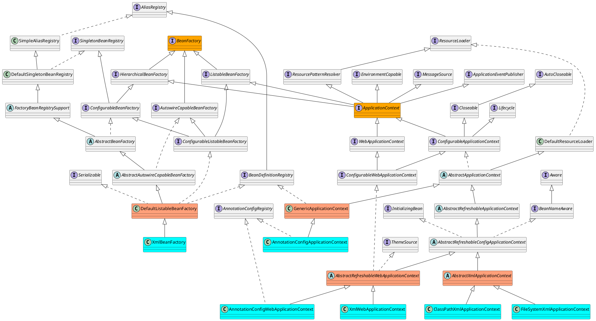
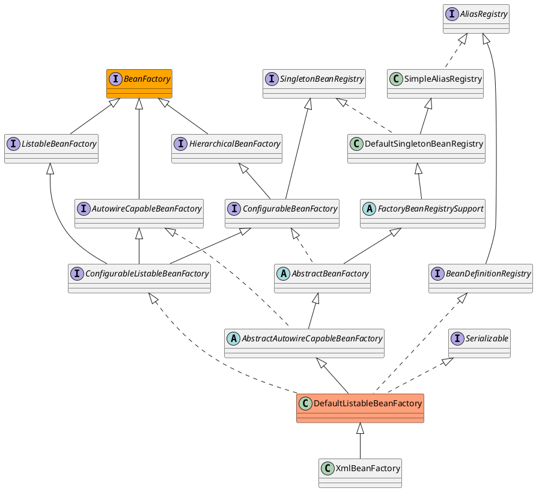
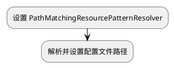

# Spring容器的基本实现

[toc]

## 前言

### 推荐阅读

> - [Spring BeanFactory 类图详解](https://blog.csdn.net/qq_34090008/article/details/78772189)
> - [spring 主要涉及类类图](https://blog.csdn.net/strivezxq/article/details/44560771)
> - [Spring容器](https://www.jianshu.com/p/ab1bf09f6501)

## 一、基本概念

### 1.容器相关类图


#### 1.1 容器概览



#### 1.2 DefaultListableBeanFactory



## 二、容器的创建过程
以 `ClassPathXmlApplicationContext` 的创建过程为例：

```java

public class ApplicationContextTest {

	@Test
	public void testClassPathXmlApplicationContext() {
		ClassPathXmlApplicationContext applicationContext = new ClassPathXmlApplicationContext("beanFactoryTest.xml");
		MyTestBean bean = (MyTestBean) applicationContext.getBean("myTestBean");
		Assert.assertEquals("testStr", bean.getTestStr());
	}

}

```


### 1.流程图




### 2.时序图


### 3.具体流程分析

ClassPathXmlApplicationContext的构造器如下：

```java
public ClassPathXmlApplicationContext(String[] configLocations, boolean refresh, ApplicationContext 	         parent) {
    //设置 PathMatchingResourcePatternResolver
    super(parent);
    setConfigLocations(configLocations);
    //默认true
    if (refresh) {
        refresh();
    }
}
```


#### 3.1 设置 PathMatchingResourcePatternResolver

（1）首先看父类构造器，沿着继承体系一直向上调用，直到AbstractApplicationContext:

```java
public AbstractApplicationContext(ApplicationContext parent) {
    this();
    setParent(parent);
}
public AbstractApplicationContext() {
    this.resourcePatternResolver = getResourcePatternResolver();
}
```

getResourcePatternResolver:

```java
protected ResourcePatternResolver getResourcePatternResolver() {
    return new PathMatchingResourcePatternResolver(this);
}
```

PathMatchingResourcePatternResolver支持Ant风格的路径解析。


由于parent 为null，因此此处是将parent置空 

```java
	@Override
	public void setParent(@Nullable ApplicationContext parent) {
        //设置 parent ApplicationContext
		this.parent = parent;
		if (parent != null) {
            // 合并父子容器的 Environment
			Environment parentEnvironment = parent.getEnvironment();
			if (parentEnvironment instanceof ConfigurableEnvironment) {
				getEnvironment().merge((ConfigurableEnvironment) parentEnvironment);
			}
		}
	}
```


#### 3.2 设置配置文件路径

即AbstractRefreshableConfigApplicationContext.setConfigLocations:

```java
	public void setConfigLocations(@Nullable String... locations) {
		if (locations != null) {
			Assert.noNullElements(locations, "Config locations must not be null");
			this.configLocations = new String[locations.length];
			for (int i = 0; i < locations.length; i++) {
				this.configLocations[i] = resolvePath(locations[i]).trim();
			}
		}
		else {
			this.configLocations = null;
		}
	}
```

resolvePath:

```java
protected String resolvePath(String path) {
    return getEnvironment().resolveRequiredPlaceholders(path);
}
```

此方法的目的在于将占位符(placeholder)解析成实际的地址。比如可以这么写: `new ClassPathXmlApplicationContext("classpath:config.xml");`那么classpath:就是需要被解析的。

getEnvironment方法来自于ConfigurableApplicationContext接口，源码很简单，如果为空就调用createEnvironment创建一个。AbstractApplicationContext.createEnvironment:

```java
protected ConfigurableEnvironment createEnvironment() {
    return new StandardEnvironment();
}
```


AbstractEnvironment.resolveRequiredPlaceholders

```
	@Override
	public String resolveRequiredPlaceholders(String text) throws IllegalArgumentException {
		return this.propertyResolver.resolveRequiredPlaceholders(text);
	}
```


AbstractPropertyResolver.resolveRequiredPlaceholders

```java
	@Override
	public String resolveRequiredPlaceholders(String text) throws IllegalArgumentException {
		if (this.strictHelper == null) {
			this.strictHelper = createPlaceholderHelper(false);
		}
		return doResolvePlaceholders(text, this.strictHelper);
	}
	
	private PropertyPlaceholderHelper createPlaceholderHelper(boolean ignoreUnresolvablePlaceholders) {
		// this.placeholderPrefix :  ${
        // this.placeholderSuffix :  }
        // this.valueSeparator    :  :
        return new PropertyPlaceholderHelper(this.placeholderPrefix, this.placeholderSuffix,
				this.valueSeparator, ignoreUnresolvablePlaceholders);
	}
	
	private String doResolvePlaceholders(String text, PropertyPlaceholderHelper helper) {
		return helper.replacePlaceholders(text, this::getPropertyAsRawString);
	}
	
```

这里是解析配置文件路径中包含的占位符

```java
System.setProperty("spring", "classpath");
ClassPathXmlApplicationContext context = new ClassPathXmlApplicationContext("${spring}:config.xml");
SimpleBean bean = context.getBean(SimpleBean.class);
```


这样就能成功设置配置文件路径了


## 三、refresh

Spring bean解析就在此方法

```java
@Override
	public void refresh() throws BeansException, IllegalStateException {
		synchronized (this.startupShutdownMonitor) {
			// Prepare this context for refreshing.
			prepareRefresh();

			// Tell the subclass to refresh the internal bean factory.
			ConfigurableListableBeanFactory beanFactory = obtainFreshBeanFactory();

			// Prepare the bean factory for use in this context.
			prepareBeanFactory(beanFactory);

			try {
				// Allows post-processing of the bean factory in context subclasses.
				postProcessBeanFactory(beanFactory);

				// Invoke factory processors registered as beans in the context.
				invokeBeanFactoryPostProcessors(beanFactory);

				// Register bean processors that intercept bean creation.
				registerBeanPostProcessors(beanFactory);

				// Initialize message source for this context.
				initMessageSource();

				// Initialize event multicaster for this context.
				initApplicationEventMulticaster();

				// Initialize other special beans in specific context subclasses.
				onRefresh();

				// Check for listener beans and register them.
				registerListeners();

				// Instantiate all remaining (non-lazy-init) singletons.
				finishBeanFactoryInitialization(beanFactory);

				// Last step: publish corresponding event.
				finishRefresh();
			}

			catch (BeansException ex) {
				if (logger.isWarnEnabled()) {
					logger.warn("Exception encountered during context initialization - " +
							"cancelling refresh attempt: " + ex);
				}

				// Destroy already created singletons to avoid dangling resources.
				destroyBeans();

				// Reset 'active' flag.
				cancelRefresh(ex);

				// Propagate exception to caller.
				throw ex;
			}

			finally {
				// Reset common introspection caches in Spring's core, since we
				// might not ever need metadata for singleton beans anymore...
				resetCommonCaches();
			}
		}
	}

```


### 1.prepareRefresh

```java
	protected void prepareRefresh() {
		// Switch to active.
		this.startupDate = System.currentTimeMillis();
		this.closed.set(false);
		this.active.set(true);

		if (logger.isDebugEnabled()) {
			if (logger.isTraceEnabled()) {
				logger.trace("Refreshing " + this);
			}
			else {
				logger.debug("Refreshing " + getDisplayName());
			}
		}

		// Initialize any placeholder property sources in the context environment.
        // 空实现
		initPropertySources();

		// Validate that all properties marked as required are resolvable:
		// see ConfigurablePropertyResolver#setRequiredProperties
		getEnvironment().validateRequiredProperties();

		// Store pre-refresh ApplicationListeners...
		if (this.earlyApplicationListeners == null) {
			this.earlyApplicationListeners = new LinkedHashSet<>(this.applicationListeners);
		}
		else {
			// Reset local application listeners to pre-refresh state.
			this.applicationListeners.clear();
			this.applicationListeners.addAll(this.earlyApplicationListeners);
		}

		// Allow for the collection of early ApplicationEvents,
		// to be published once the multicaster is available...
		this.earlyApplicationEvents = new LinkedHashSet<>();
	}
```

#### 1.1 属性校验

AbstractEnvironment.validateRequiredProperties:

```java
@Override
public void validateRequiredProperties() throws MissingRequiredPropertiesException {
    this.propertyResolver.validateRequiredProperties();
}
```

AbstractPropertyResolver.validateRequiredProperties:

```java
@Override
public void validateRequiredProperties() {
    MissingRequiredPropertiesException ex = new MissingRequiredPropertiesException();
    for (String key : this.requiredProperties) {
        if (this.getProperty(key) == null) {
            ex.addMissingRequiredProperty(key);
        }
    }
    if (!ex.getMissingRequiredProperties().isEmpty()) {
        throw ex;
    }
}
```

requiredProperties是通过setRequiredProperties方法设置的，保存在一个list里面，默认是空的，也就是不需要校验任何属性。


### 2.obtainFreshBeanFactory

创建 BeanFactory

```java
	protected ConfigurableListableBeanFactory obtainFreshBeanFactory() {
		refreshBeanFactory();
		return getBeanFactory();
	}
```


调用AbstractRefreshableApplicationContext.refreshBeanFactory:

```java
    /**
	 * This implementation performs an actual refresh of this context's underlying
	 * bean factory, shutting down the previous bean factory (if any) and
	 * initializing a fresh bean factory for the next phase of the context's lifecycle.
	 */
	@Override
	protected final void refreshBeanFactory() throws BeansException {
		if (hasBeanFactory()) {
			//如果已经存在，那么销毁之前的
			destroyBeans();
			closeBeanFactory();
		}
		try {
			//创建了一个DefaultListableBeanFactory对象
			DefaultListableBeanFactory beanFactory = createBeanFactory();
			beanFactory.setSerializationId(getId());
			//定制 BeanFactory
			customizeBeanFactory(beanFactory);
			//加载Bean
			loadBeanDefinitions(beanFactory);
			this.beanFactory = beanFactory;
		}
		catch (IOException ex) {
			throw new ApplicationContextException("I/O error parsing bean definition source for " + getDisplayName(), ex);
		}
	}
```


#### 2.1 BeanFactory定制


