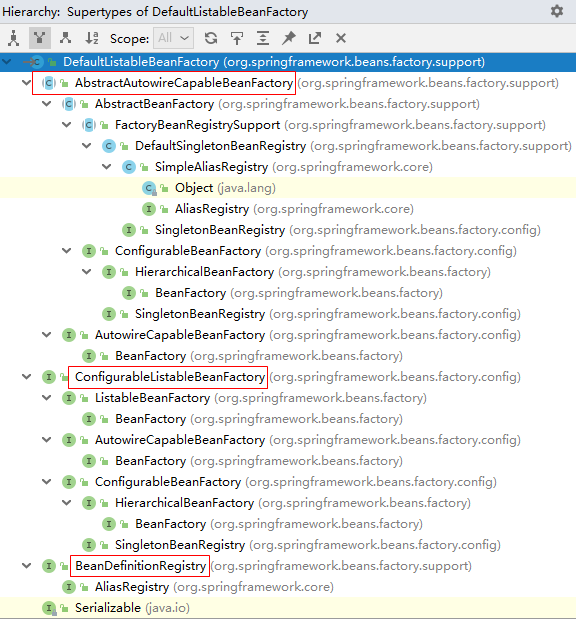
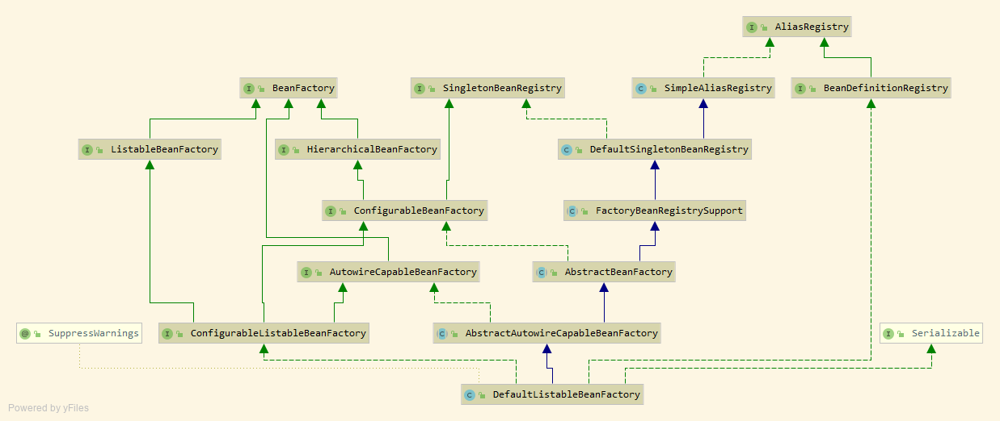

[TOC]

# 前言

# 一、两个核心类

## 1.DefaultListableBeanFactory

>- XmlBeanFactory 继承向 DefaultListableBeanFactory ，而 **DefaultListableBeanFactory 是整个bean**
>  **加载的核心部分，是Spring 注册及加载 bean 的默认实现**。
>
>- 而对于 XmlBeanFactory  与 DefaultListableBeanFactory 不同的地方其实是在 XmlBeanFactory  中使用了自定义的XML 读取器 XmlBeanDefinitionReader ，实现了个性化的 BeanDefinitionReader 读取。
>-  DefaultListableBeanFactory  继承了 AbstractAutowireCapableBeanFactory 并实现了ConfigurableListableBeanFactory 以及
>  BeanDefinitionRegistry 接口。

### 1.1 层次结构图

### 1.2 类图

## 2.XmlBeanDefinitionReader

XML 配置文件的读取是 Spring 中重要的功能，因为 Spring 的大部分功能都是以配置作为
切入点的，那么我们可以从 XmlBeanDefinitionReader 中梳理一下资源文件读取、解析及注册的
大致脉络，首先我们看看各个类的功能：

