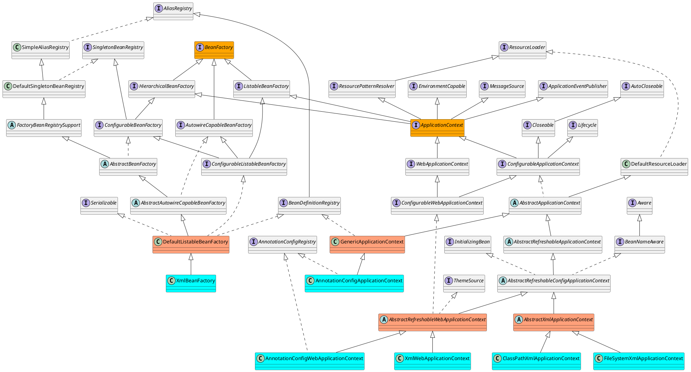
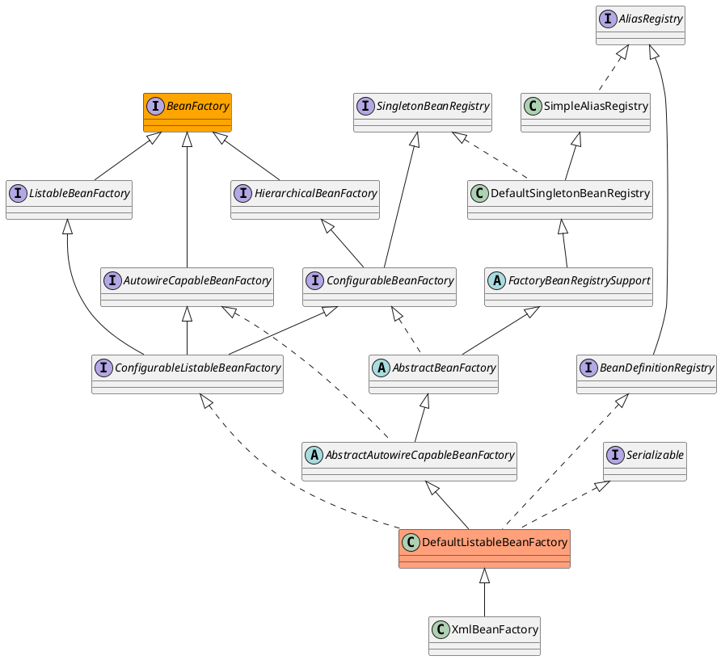

# Spring容器的基本实现

[toc]

## 前言

### 推荐阅读

> - [Spring BeanFactory 类图详解](https://blog.csdn.net/qq_34090008/article/details/78772189)
> - [spring 主要涉及类类图](https://blog.csdn.net/strivezxq/article/details/44560771)
> - [Spring容器](https://www.jianshu.com/p/ab1bf09f6501)

## 一、基本概念

### 1.容器相关类图

#### 1.1 容器概览

#### 1.2 DefaultListableBeanFactory

