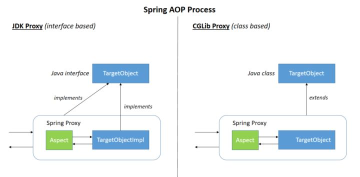
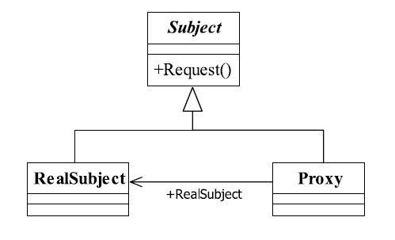
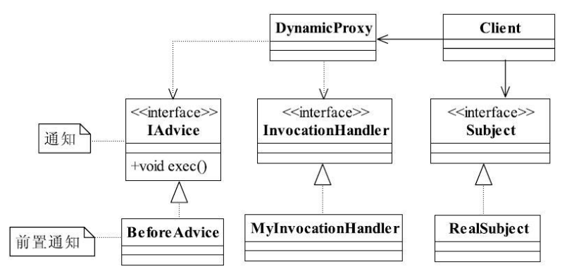

# Spring源码分析_04_AOP

[toc]

## 推荐阅读

> - [Spring 源码学习(八) AOP 使用和实现原理](http://www.justdojava.com/2019/07/17/spring-analysis-note-8/)
> - [SpringBoot2 | Spring AOP 原理深度源码分析（八）](https://juejin.im/post/5ce4d8e451882533591d549a)
> - [Spring 源码学习(八) AOP 使用和实现原理](https://juejin.im/post/5d2f43ab5188257e302863de)
> - [Spring源码分析-AOP](https://binglau7.github.io/2017/12/18/Spring%E6%BA%90%E7%A0%81%E5%88%86%E6%9E%90-AOP/)

## 推荐项目

> - https://gitee.com/vip-augus/spring-analysis-note
> - https://github.com/MrSorrow/spring-framework

## 一、动态 AOP 使用示例

### 1. 创建用于拦截的 bean

创建用于拦截的 bean

```java
public class TestBean {

	private String testStr = "testStr";

	public void testAop() {
		// 被拦截的方法，简单打印
		System.out.println("I am the true aop bean");
	}
}

```


### 2.创建 Advisor

```java
@Aspect
public class TestBeanAspect {

	@Pointcut("execution(* *.testAop(..))")
	public void test() {

	}

	@Before("test()")
	public void beforeTest() {
		System.out.println("beforeTest");
	}

	@After("test()")
	public void afterTest() {
		System.out.println("afterTest");
	}

	@Around("test()")
	public Object aroundTest(ProceedingJoinPoint p) {
		System.out.println("brfore around");
		Object o = null;
		try {
			o = p.proceed();
		} catch (Throwable e) {
			e.printStackTrace();
		}
		System.out.println("after around");
		return o;
	}
}

```


### 3.创建配置文件

- src/test/resource/aop/TestBeanAspect-aop.xml

  ```
  <?xml version="1.0" encoding="UTF-8"?>
  <beans xmlns="http://www.springframework.org/schema/beans"
  	   xmlns:xsi="http://www.w3.org/2001/XMLSchema-instance"
  	   xmlns:aop="http://www.springframework.org/schema/aop"
  	   xsi:schemaLocation="http://www.springframework.org/schema/beans https://www.springframework.org/schema/beans/spring-beans-2.0.xsd
         http://www.springframework.org/schema/aop https://www.springframework.org/schema/aop/spring-aop-2.0.xsd">
  
  	<!--开启 AOP 功能-->
  	<aop:aspectj-autoproxy />
  
  	<bean id="testBean" class="com.ray.study.spring.aop.TestBean"/>
  
  	<bean class="com.ray.study.spring.aop.TestBeanAspect" />
  
  </beans>
  ```

  


### 4.测试

```
	@Test
	public void testAop() {
		ApplicationContext ctx = new ClassPathXmlApplicationContext("aop/TestBeanAspect.xml");
		TestBean bean = (TestBean) ctx.getBean("testBean");
		bean.testAop();
	}
```


输出日志：

```
brfore around
beforeTest
I am the true aop bean
after around
afterTest
```


## 二、基本概念与相关类图

### 1.基本概念

参考：
> - [Spring AOP(一) AOP基本概念](https://segmentfault.com/a/1190000018120725)

基本概念：

> - Join point: 连接点, 也是关注点，目标对象的目标方法
> - pointcut: 切点，匹配一系列连接点
> - Weaving：织入, 对关注点的增强过程叫做织入
> - Advice：即是增强,包括 Before 、After 等增强
> - Aspect： 切面,是横切关注点的模块化，包括连接点，切点，增强的一个载体.
> - Target object: 目标对象
> - AOP proxy: AOP 代理器，包括JDK动态代理器，和CGLIG 动态代理器
> - Proxy: 代理对象，由代理器创建的代理对象


简单来讲，整个 aspect 可以描述为:

> 满足 pointcut 规则的 joinpoint 会被添加相应的 advice 操作


SpringAOP 代理过程：




### 2.相关类图

参考：

> - [SpringBoot2 | Spring AOP 原理深度源码分析（八）](https://juejin.im/post/6844903848566325261#heading-2)


#### 2.1 advisorCreator


> - AbstractAutoProxyCreator: Spring 为Spring AOP 模块暴露的可扩展抽象类，也是 AOP 中最核心的抽象类
> - AbstractAdvisorAutoProxyCreator: 扫描所有类，判断是否可以被代理，并寻找合适的增强类，以及生成代理类
> - AnnotationAwareAspectJAutoProxyCreator: 开启AOP功能后，该类会扫描所有@Aspect注释的类，生成对应的adviosr


#### 2.2 advisor


#### 2.3 advice


## 三、JDK动态代理与CGLIB动态代理

## 1.代理模式





### 2.1 JDK动态代理





### 2.2 CGLIB动态代理


## 四、AOP 代理对象的创建流程

主要涉及如下流程：
> (1) 容器创建过程中，注册或升级 AnnotationAwareAspectJAutoProxyCreator
> (2) Bean创建时，创建AOP代理
> 

### 1.注册或升级 AnnotationAwareAspectJAutoProxyCreator


> (1) 注册或升级 AnnotationAwareAspectJAutoProxyCreator 的 BeanDefinition
> (2) 处理 proxy-target-class 以及 expose-proxy 属性的处理
> (3) 注册组件并通知，便于监听器作进一步处理

#### 1.1 AOP 功能的开启

配置文件中的 `<aop:aspectj-autoproxy />` 标签开启了AOP功能

```java
public class AopNamespaceHandler extends NamespaceHandlerSupport {

	/**
	 * Register the {@link BeanDefinitionParser BeanDefinitionParsers} for the
	 * '{@code config}', '{@code spring-configured}', '{@code aspectj-autoproxy}'
	 * and '{@code scoped-proxy}' tags.
	 */
	@Override
	public void init() {
		// In 2.0 XSD as well as in 2.1 XSD.
		registerBeanDefinitionParser("config", new ConfigBeanDefinitionParser());
		registerBeanDefinitionParser("aspectj-autoproxy", new AspectJAutoProxyBeanDefinitionParser());
		registerBeanDefinitionDecorator("scoped-proxy", new ScopedProxyBeanDefinitionDecorator());

		// Only in 2.0 XSD: moved to context namespace as of 2.1
		registerBeanDefinitionParser("spring-configured", new SpringConfiguredBeanDefinitionParser());
	}

}
```

这个标签的解析器为 `AspectJAutoProxyBeanDefinitionParser` 


### 2.创建AOP代理

在容器创建过程中，注册了 AnnotationAwareAspectJAutoProxyCreator 的 BeanDefinition, 而在后续加载这个Bean时，由于此Bean实现了 BeanPostProcessor，因此会在其实例化时，调用其 postProcessAfterInstantiation 方法。

> - AbstractApplicationContext.refresh() -> finishBeanFactoryInitialization() 
> - DefaultListableBeanFactory.preInstantiateSingletons() -> getBean() -> doGetBean()
> - AbstractAutowireCapableBeanFactory.createBean() -> doCreateBean() -> initializeBean() -> applyBeanPostProcessorsAfterInitialization()
> - BeanPostProcessor.postProcessAfterInitialization()

也就是说AOP代理创建的入口为 AnnotationAwareAspectJAutoProxyCreator父类AbstractAutoProxyCreator的postProcessAfterInitialization 方法


> (1) 获取符合条件的增强
> (2) 根据获取的增强创建 AOP代理
> (3) 根据AOP代理创建代理对象


